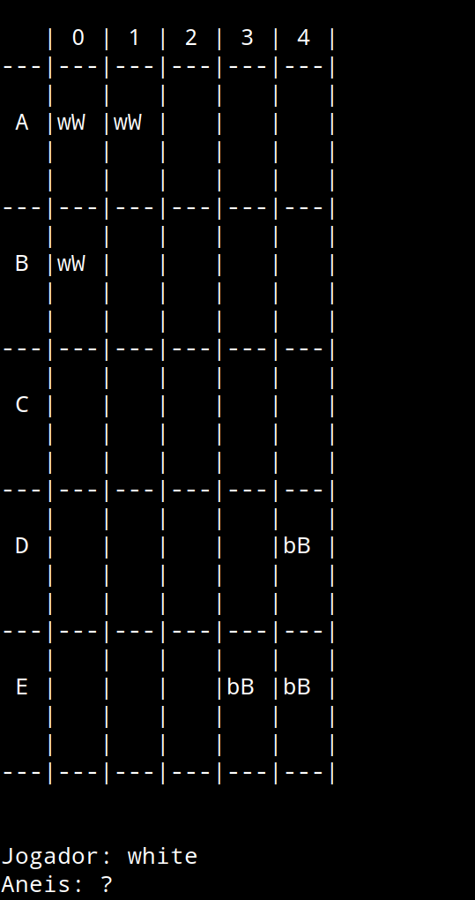
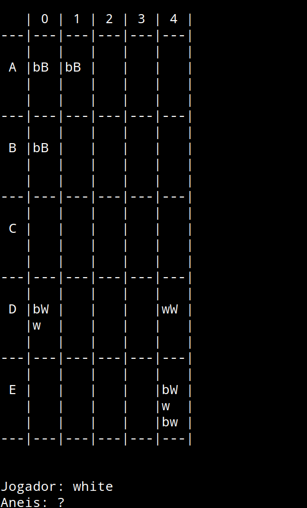

# Mitsudomoe
## PLOG_TP1_RI_T7_Mitsudomoe2

| Name             | Number    | E-Mail             |
| ---------------- | --------- | ------------------ |
| Luís Assunção    | 201806140 |up201806140@fe.up.pt|
| João Rocha       | 201806261 |up201806261@fe.up.pt|

## Descrição do jogo

[Regras](https://www.nestorgames.com/rulebooks/MITSUDOMOE_EN.pdf)

### Conceito
Mitsudomoe é um jogo de 2 a 4 jogadores (neste caso 2) cujo objetivo é o jogador colocar as suas peças no outro lado do tabuleiro mais rapidamente que o adversário. 

### Início
Inicialmente cada jogador tem 3 bolas nas suas posições iniciais e cada bola sobre um anel da sua cor (branco ou preto) e cada jogador tem um total de 8 anéis.

### Jogada
Uma jogada é dividida em dois passos:
- Adicionar ou mover um anel. Pode adicionar ou mover o anel para qualquer casa do tabuleiro desde que não haja lá uma bola, mesmo que isso implique fazer uma pilha de anéis e desde que o anel inicial não esteja debaixo de uma bola nem de outro anel.
- Mover uma bola (há duas formas de mover uma bola)
    - Mover uma bola para cima de um anel da mesma cor num espaço adjacente, seja este ortogonal ou diagonal.
    - Mover uma bola por cima de uma fila de bolas até ao outro lado, recolocando-as (vaulting, ver em baixo).

### Vaulting
Consiste na jogada onde se movimenta a bola, numa linha reta por cima de um conjunto sucessivo de bolas próprias ou adversárias até chegar a uma casa com um anel da cor respetiva. No final desta jogada as bolas que foram "vaulted" serão recolocadas.

### Factos gerais do jogo
- Uma bola quando chega à posição final nunca de lá sai
- Uma bola tem sempre um anel da mesma cor por baixo
- Nenhuma peça do tabuleiro abandona o tabuleiro

## Representação do jogo
O tabuleiro é representado através de uma lista de listas de listas (linhas*colunas*stack). Em cada par linha/coluna há uma stack cuja cabeça é a bola (white_ball, black_ball ou empty) e 10 espaços para anéis colocados numa stack (white_ring, black_ring, empty). É apresentado também qual o jogador a jogar e quantos anéis tem disponíveis para adicionar.
Visualmente, cada célula é constituída por um retêngulo 3*5 cujo centro é a bola, representada por W ou B consoante a cor (White or Black), circundada por anéis, representados por w e b consoante a cor (white or black). O anel do canto superior esquerdo é considerado o topo da stack, sendo que só é ocupado se estiverem 10 anéis na stack (altamente improvável). A partir daí, a ordem dos anéis baixa em sentido horário até se chegar à casa debaixo do canto superior esquerdo, que representa a 10ª posição da stack, ou seja, o anel do fundo. Esta posição estará obrigatoriamente preenchida se houver um uma bola nessa casa.

-
-
-

## Observações
Os anéis terão de serão contados de acordo com a altereção do estado do jogo pelo que nos estados de jogo apresentados na primeira entrega não estarão contemplados, pois os tabuleiros são hard-coded.

                     
     
           
                      
